This is a software that contains seismic forward modeling, ray tracing, text editing and plotting. You can get the whole diretory&files in ```ALL.zip```
这是一个包含了地震正演模拟，射线追踪，文本编辑和绘制曲线图的软件

## Directory & file tree in file "DirTree.md"

* simple directory tree as follows(Detail in DirTree.md)

```shell
root
├── clean.sh
├── Compile.sh
├── lib
│   ├── include
│   └── seismic
├── MainWindow.java
├── Makefile
├── net
│   └── java
│       └── dev
│           └── designgridlayout
├── picture
│   ├── Author
│   ├── BackGround
│   ├── ButtonImg
│   └── Expression
└── src
    ├── about
    ├── menu
    ├── myComponent
    ├── paint
    ├── seismic
    ├── swap
    └── text

20 directories, 225 files
```

## Compiled & RUN: 

```shell
$ make # or
$ sh Compile.sh
```

* You can use clean.sh to clean all .class and other temp

```shell
$ sh clean.sh
```

### Denpendence

* JDK 8+
* JNI
* gcc
* Linux is the best env.

## Software GUI

* RayTracing 射线追踪

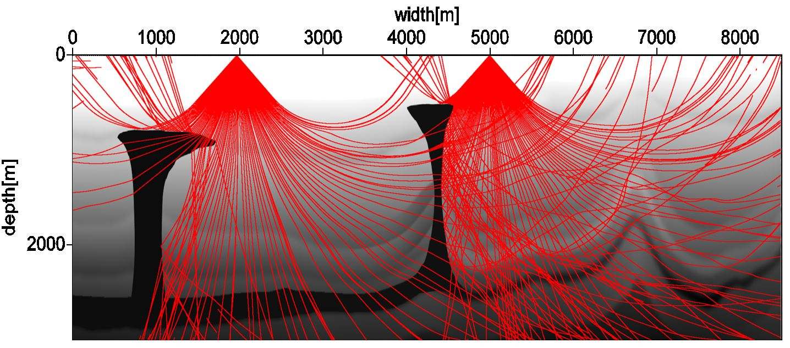

* Main Window
* 
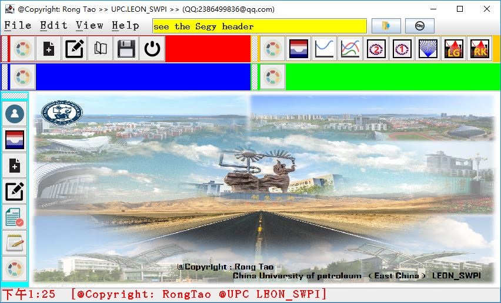
* Buttons (from left to right)
* New Text
* 
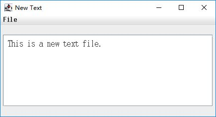
* New Text with Edit
* 
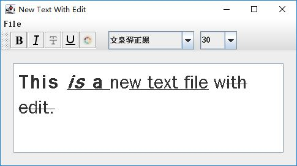
* Open Text
* 

* show a binary file into a picture
* 
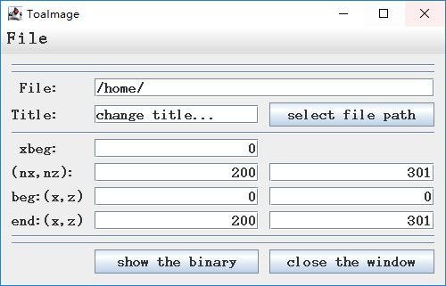
* in the next two is drawing ling and lines, pass it
* the next tow is Finite Difference (VTI media), for example
* 
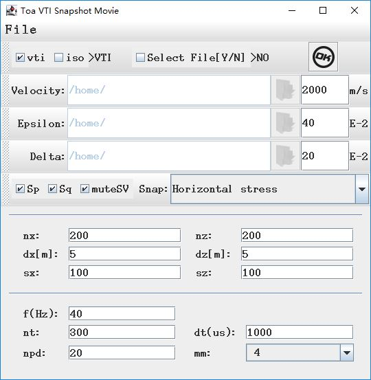
* it result:
* 
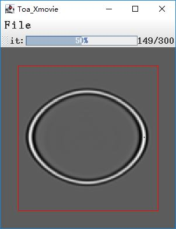
* the next two is Ray tracing(isotropic and anisotropic)
* 
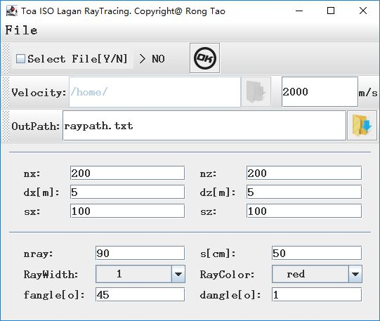
* result 1: velocity is constant value
* 
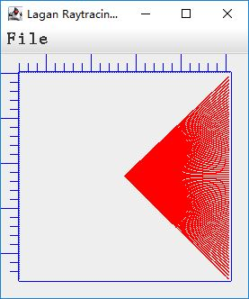
* result 2: velocity is not constant
* 
* 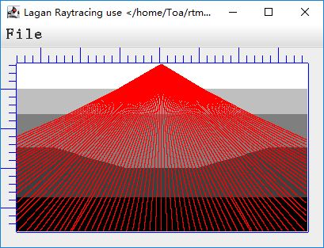

## Vertical Tool Bar
* first one is author (RongTao) introduction
* 
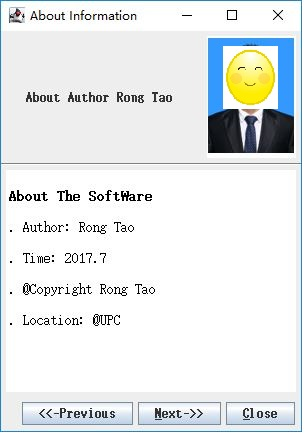
